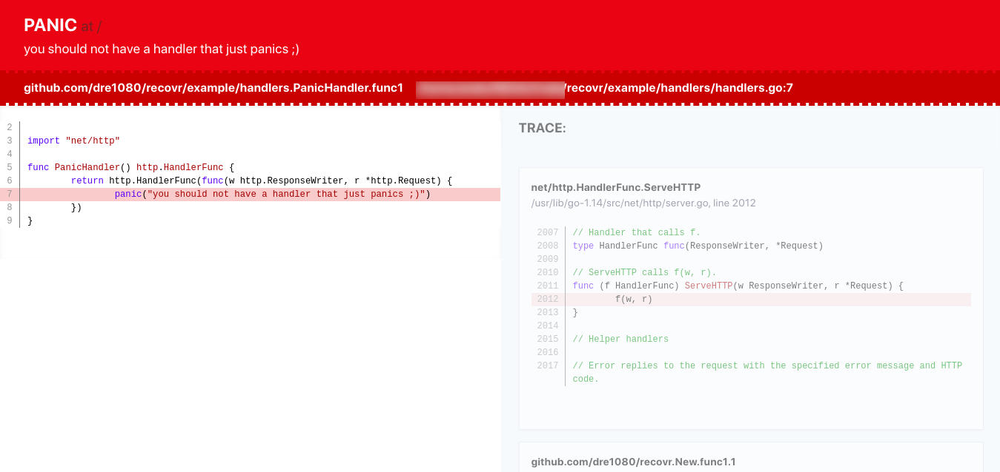
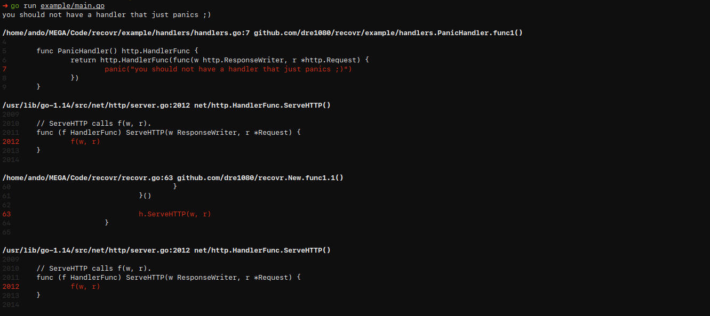
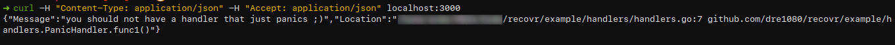

# recovr

[](https://pkg.go.dev/github.com/dre1080/recovr)

Recovr is a HTTP middleware that catches any panics and serves a proper error response.

Works with all frameworks that support native http handler (eg. [Fiber](https://github.com/gofiber/fiber), [Echo](https://github.com/labstack/echo), [Gin](https://github.com/gin-gonic/gin), [Goji](https://github.com/zenazn/goji), etc.).



## Installation

```
$ go get github.com/dre1080/recovr
```

## Usage

```go
package main

import (
    "log"
    "net/http"

    "github.com/dre1080/recovr"
)

var myPanicHandler = http.HandlerFunc(func(w http.ResponseWriter, r *http.Request) {
    panic("you should not have a handler that just panics ;)")
})

func main() {
    recovery := recovr.New()
    app := recovery(myPanicHandler)
    http.ListenAndServe("0.0.0.0:3000", app)
}
```

## Examples

### Fiber Example

```go
import (
	"github.com/gofiber/fiber"
	"github.com/gofiber/adaptor"
)

func main() {
    app := fiber.New()
    app.Use(adaptor.HTTPHandler(recovr.New()))
    app.Listen(3000)
}
```

### Gin Example

```go
import "github.com/gin-gonic/gin"

func main() {
    g := gin.Default()
    g.Use(gin.WrapH(recovr.New()))
    g.Run()
}
```

### Echo Example

```go
import "github.com/labstack/echo/v4"

func main() {
    e := echo.New()
    e.Use(echo.WrapHandler(recovr.New()))
    e.Run(":3000")
}
```

### Goji Example

```go
import "github.com/zenazn/goji"

func main() {
    goji.Use(recovr.New())
    goji.Serve()
}
```

## Screenshots

- **Logger**



- **JSON**



- **HTML**


