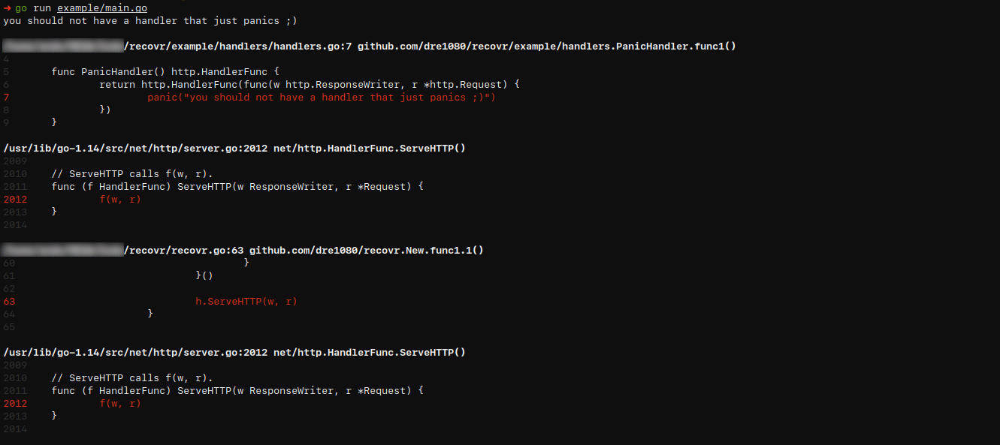

# recovr

[](https://pkg.go.dev/github.com/dre1080/recovr)

Recovr is a HTTP middleware that catches any panics and serves a proper error response.

Works with all frameworks that support native http handler (eg. [Echo](https://github.com/labstack/echo), [Goji](https://github.com/zenazn/goji), etc.).


## Installation

```
$ go get github.com/dre1080/recovr
```

## Usage

```go
package main

import (
    "net/http"

    "github.com/dre1080/recovr"
)

var myPanicHandler = http.HandlerFunc(func(w http.ResponseWriter, r *http.Request) {
    panic("you should not have a handler that just panics ;)")
})

func main() {
    recovery := recovr.New()
    app := recovery(myPanicHandler)
    http.ListenAndServe("0.0.0.0:3000", app)
}
```

## Examples

### Echo Example

```go
import "github.com/labstack/echo/v4"

func main() {
    e := echo.New()
    e.Use(echo.WrapMiddleware(recovr.New()))
    e.Logger.Fatal(e.Start(":1323"))
}
```

### Goji Example

```go
import "github.com/zenazn/goji"

func main() {
    goji.Use(recovr.New())
    goji.Serve()
}
```

## Screenshots

- **Logger**



- **JSON**


- **HTML**


